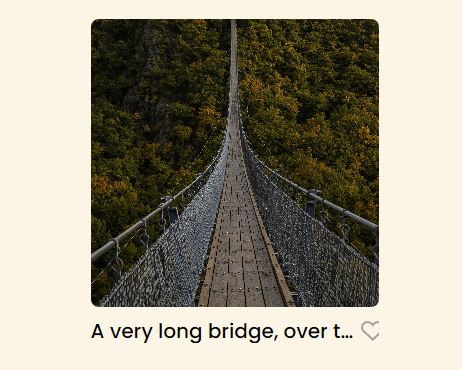
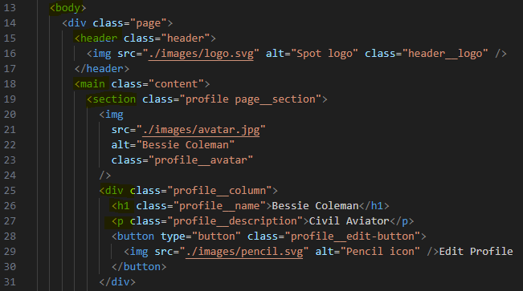

Sprint 3 Project: Spots

This is my project for Sprint 3 called Spots. For this project I created an interactive social media application where users can upload and delete, include descriptions, and "like" photos from other users. I also added the ability to edit the users profile as well.

This project took much more effort compared to the others tackled in the past. Upon completing the tasks and assignments, Sprint 3 introduced useful properties and are applicable to this day and age. Including the use of figma, grid, responsive design with media queries and overflow. This sprint also helped to reinforce comprehension from the lessons in past sprints. We made further use of BEM, semantic tags, flex containers, lists, importing style sheets, hover states, pointers, buttons and applying font families to name a few.

The layout of the web application is pretty standard when compared to other available social media sites. This application called Spots is an interactive website where people can upload images to places they have possibly been to. When uploading their photos they can also include a description of the photo. If the description is too long to fit inside the given space, the text will be cut off indicated by 3 periods. Based on the viewport this space can vary in change. If the viewport is smaller, like a mobile phone, the desctipion will appear shorter as well. Futhermore, on a desktop computer the website by default will display 3 photos max in a row. If you are viewing this web application on a tablet it will display 2 photos in a row and on mobile 1 photo columns.

With the simplicity of the webpage, it can be easy to understand and how to navigate through the application. Users can interact with 3 possible buttons. These can be indicated by a hover state. If the user wants to edit their profile or add a new post, the buttons will become opaque when hovering over them as well as change the cursor to a pointer.

https://jonahsanpedro.github.io/se_project_spots/

https://drive.google.com/file/d/1T8blxOMXMYKJA-cVeA2oDoCR8l5zpqPr/view?usp=sharing
